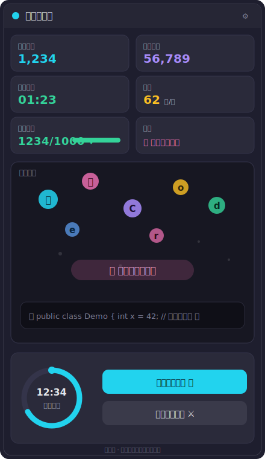

# 码字计时器 · 摸鱼休息提醒 — 用户使用说明书

> 适用版本：PyCharm 版（`com.coder.typing-time-counter`）与 IntelliJ IDEA 版（`com.coder.typing-time-counter-idea`）
> 两份插件功能**完全一致**，本文档以「本插件」统称，仅在安装处区分 IDE。

---

## 1. 这是什么

一个给「长时间在 IDE 里敲代码的人」准备的小工具。它帮你：

- 📊 **看见自己的码字量**：今天敲了多少字、累计多少字、连续敲了多久、手速多快。
- ⏰ **按时被提醒休息**：码满设定时长，就弹个幽默气泡催你去走走，保护颈椎和屁股。
- 🎆 **敲字有爽感**：专门的「码字舞台」把每次按键变成上飘的光点、流动弹幕和炸裂大字，打工也有仪式感。
- 😜 **不枯燥**：状态栏和提醒全程沙雕文案，摸鱼也理直气壮。

---

## 2. 安装

### 方式一：从磁盘安装（自己构建）

1. 用 **PyCharm** 打开 `Pycharm/` 文件夹，或用 **IntelliJ IDEA** 打开 `IDEA/` 文件夹，作为 Gradle 项目导入。
2. 等待 Gradle 自动下载对应 IDE 的 SDK（首次较慢，约几百 MB）。
3. 打开 **Gradle 工具窗 → `Tasks → intellij → buildPlugin`**，产物在 `build/distributions/*.zip`。
   - 命令行等价：在对应文件夹执行 `gradlew buildPlugin`（IDE 导入时会自动补全 `gradle-wrapper.jar`）。
4. `Settings → Plugins → ⚙️ → Install Plugin from Disk…`，选择上一步的 zip，按提示重启 IDE。

> 安装后**无需任何额外配置**即可开始使用，默认就会统计和提醒。

---

## 3. 快速上手

1. 安装重启后，IDE 右侧出现名为 **「码字计时器」** 的工具窗（Tool Window）。点开它。
2. 随便在一个编辑器里敲几个字 —— 你会立刻看到：
   - 顶部数字在跳；
   - 中间的「码字舞台」冒出上飘的光点；
   - 底部圆环开始走进度。
3. 在 `Settings → 码字计时 & 休息提醒` 里调成你喜欢的节奏（见第 5 节）。

---

## 4. 界面说明

> 上图为工具窗布局示意（默认深色主题观感）：顶部 6 张统计卡片、中央「码字舞台」、底部休息倒计时圆环与两个操作按钮。颜色与上飘字符为示意，实际以运行效果为准。

工具窗从上到下分为三块：

### 4.1 顶部 · 统计卡片
| 卡片 | 含义 |
| --- | --- |
| 今日码字 | 当天累计敲入的字符数（跨项目累计，凌晨自动清零） |
| 累计码字 | 装了插件以来所有字符的总和 |
| 今日时长 | 今天「真正在敲」的连续时间（发呆 / 离开不计入） |
| 手速 | 实时估算的每分钟字符数（CPM） |
| 每日目标 | 你设定的当日目标，及完成进度 |
| 状态 | 每秒轮换的幽默文案（如「手指在键盘上跳踢踏舞 💃」） |

### 4.2 中央 · 码字舞台（强动效）
- **上飘光点**：你每敲一个字符，就有一颗带光晕的彩色字符从底部蹦出、向上飘并淡出。
- **流动弹幕带**：底部一条会横向滚动的输入流，记录你最近敲的内容。
- **炸裂大字**：每满 100 字，或达成当日目标时，中央会炸出一句祝贺（如「🎉 又肝了一百字，牛！」）。

> 动效纯本地绘制，不会上传任何字符内容，也几乎不吃性能。

### 4.3 底部 · 休息倒计时 + 操作
- **倒计时圆环**：渐变进度环 + 发光端点，实时显示「距离下次休息还有多久」。
- **「现在就去走走 🚶」**：点了立刻把休息倒计时清零、重新开始计时（相当于「我已起身」）。
- **「我再战一会儿 ⚔️」**：临时延后本次休息提醒。

---

## 5. 设置项

入口：`Settings / Preferences → 码字计时 & 休息提醒`

| 选项 | 说明 | 范围 |
| --- | --- | --- |
| 开启休息提醒 | 总开关。关掉后只计数、不弹提醒 | 开 / 关 |
| 休息间隔（分钟） | 连续码字满这么久，就提醒你休息 | 5 ~ 180 分钟，默认 45 |
| 贪睡时长（分钟） | 点了「再战一会儿」后，延后多久再提醒 | 1 ~ 60 分钟，默认 5 |
| 每日码字目标 | 达成后会在舞台炸出祝贺，并计入目标进度 | 100 ~ 5000 字，默认 1000 |

修改即时生效，无需重启。

---

## 6. 休息提醒是怎么工作的

1. 你持续敲字，**累计活跃时长**达到「休息间隔」时，右下角弹出**幽默气泡**：
   - 例如：「🦵 你的腿已经睡着了，快起来走走，叫醒它们！」
   - 例如：「🪑 屁股和椅子已融为一体？是时候解除了。」
2. 气泡带两个动作：
   - **「现在就去走走 🚶」**：确认休息，倒计时归零重来。
   - **「我再战一会儿 ⚔️」**：贪睡，按「贪睡时长」延后再次提醒。
3. 倒计时圆环会与提醒逻辑同步：被「贪睡」或「已休息」时会重置。

> 空闲超过 1 分钟不计入活跃时长，所以去倒杯水不会被算成「在码字」。

---

## 7. 数据去哪了

- 所有统计数据保存在 **IDE 的本地配置目录**（`typing-time-counter.xml`），**不联网、不上传**。
- 「今日」数据按自然日（IDE 本地时间）自动重置；「累计」数据长期保留。
- 换电脑 / 重装 IDE 不会自动同步（数据跟着那台机器的 IDE 配置走）。

---

## 8. 常见问题（FAQ）

**Q1：为什么我敲了字，数字没动？**
A：确认工具窗已打开且插件已启用（`Settings → Plugins` 里本插件处于 Enabled）。统计是全局的，不依赖工具窗是否可见，但首次请确认没被禁用。

**Q2：粘贴大段代码算字数吗？**
A：算。粘贴触发的文档变更也会计入码字量（都算你写的，不亏）。

**Q3：能不能只计数、不提醒？**
A：可以。设置里把「开启休息提醒」关掉即可。

**Q4：休息间隔最短 / 最长多少？**
A：5 ~ 180 分钟；贪睡 1 ~ 60 分钟；每日目标 100 ~ 5000 字。

**Q5：动效会不会很卡？**
A：不会。动效用轻量 Swing 定时器（约 30 帧/秒）本地绘制，正常机器无感占用。

**Q6：支持哪些 IDE 版本？**
A：当前构建声明兼容 IntelliJ 平台 **2021.3 ~ 2026.2**（sinceBuild 213 / untilBuild 263.*）。如需支持更早的 2020.x 平台，需把 `sinceBuild` 调回 `"203"` 并将编译目标降回 Java 8（二者配套）。

**Q7：PyCharm 版和 IDEA 版数据互通吗？**
A：不通。两份插件各自独立存储（同一台机器上若两边都装，数据各算各的）。功能完全一致。

---

## 9. 卸载

`Settings → Plugins → 已安装`，找到「码字计时器 · 摸鱼休息提醒」，点卸载并重启。本地统计数据随插件配置一同移除。
